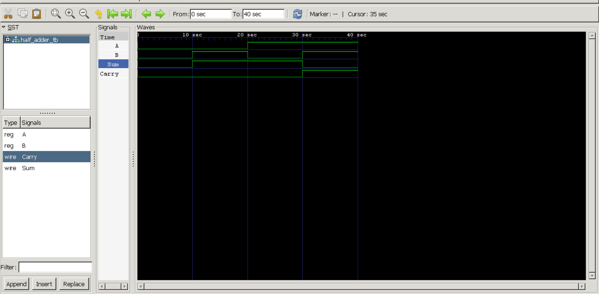

# Half Adder

## Objective

Design, simulate, and verify a Half Adder using Verilog HDL.

## Theory

A Half Adder performs the addition of two single-bit binary inputs.

### Inputs
- A
- B

### Outputs
- Sum
- Carry

### Logic Equations

Sum = A XOR B

Carry = A AND B

## Truth Table

| A | B | Sum | Carry |
|---|---|---|---|
| 0 | 0 | 0 | 0 |
| 0 | 1 | 1 | 0 |
| 1 | 0 | 1 | 0 |
| 1 | 1 | 0 | 1 |

## Project Structure

```text
01_Half_Adder
├── half_adder.v
├── half_adder_tb.v
├── waveform.png
└── README.md
```

## Tools Used

- Verilog HDL
- Icarus Verilog
- GTKWave

## Simulation Waveform



## Results

The design was successfully simulated and verified.  
The waveform confirms correct Sum and Carry outputs for all input combinations.

## Author

Dan Koshy Samuel
